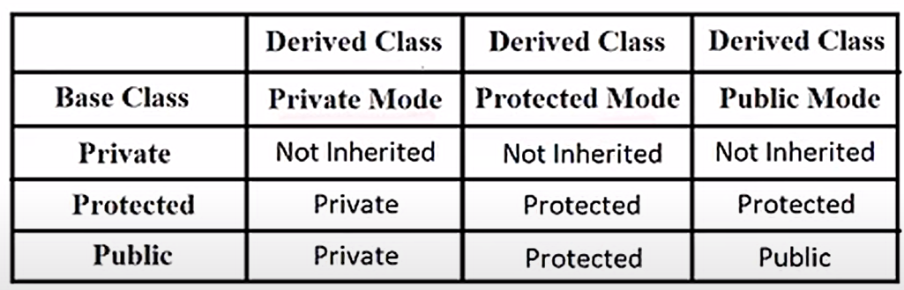

# Object-Oriented Programming in C++

## What is OOPS?

**Object-Oriented Programming System (OOPS)** is a programming pattern based on the concept of "objects", which can contain data in the form of fields (often called attributes or properties) and code in the form of procedures (often called methods or functions).

It allows for organizing complex programs, improves modularity, and promotes code reuse.

## Key Concepts of OOPS:
- **Class**: A blueprint for creating objects. It defines properties and methods.
- **Object**: An instance of a class. It represents a real-world entity.
- **Encapsulation**: Wrapping data and methods into a single unit (class) and restricting access to some of the object's components. The idea of data hiding comes here. Like hiding informations like bank password and all.
- **Abstraction**: Hiding internal implementation details and showing only the necessary features.
- **Inheritance**: Mechanism by which one class can inherit properties and methods from another.
- **Polymorphism**: The ability to take many forms. It allows methods to do different things based on the object calling them. Ex: Constructor Overloading.

## Advantages of OOPS:
- Modularity
- Code reusability
- Scalability
- Maintainability

# Basic Syntax of Class and Object in C++

```cpp
#include <iostream>
using namespace std;

// Class declaration
class ClassName {
public:
    // Data members (attributes/properties)
    int data;

    // Member functions (methods/member funcs)
    void display() {
        cout << "Data = " << data << endl;
    }
};

int main() {
    // Creating an object of ClassName
    ClassName obj;

    // Accessing data members and methods
    obj.data = 10;
    obj.display();

    return 0;
}
```
# Access Specifiers in C++

In C++, **access specifiers** define the scope and visibility of class members (data and functions). There are three primary access specifiers:

---

## 1. `private`

- **Default** access specifier if none is explicitly mentioned.
- Members declared as `private` are accessible **only within the class itself**.
- Ideal for **data hiding** and enforcing **encapsulation**.


## 2. `public`
- Members declared as public can be accessed from anywhere in the program (inside or outside the class).
- Used for member functions that provide access to private or protected data.

### Example:

```cpp
class MyClass {
private:
    int secret;

public:
    void setSecret(int s) {
        secret = s;
    }

    int getSecret() {
        return secret;
    }
};

int main() {
    MyClass obj;
    obj.setSecret(123);
    cout << obj.getSecret();  // Outputs: 123
    // obj.secret = 5;        // ❌ Error: 'secret' is private
    return 0;
}
```

# Getter and Setter Methods in C++

In Object-Oriented Programming, **getter** and **setter** methods are used to access and modify private data members of a class. They help achieve **encapsulation** by controlling how data is accessed or modified.

---

## Why Use Getters and Setters?

- To enforce data **validation** before setting a value.
- To allow **read-only** or **write-only** access.
- To **hide internal implementation** from the user.

---

## Syntax and Example

```cpp
#include <iostream>
using namespace std;

class Student {
private:
    int age;  // private data member

public:
    // Setter method to set the value
    void setAge(int a) {
        if (a >= 0)
            age = a;
        else
            cout << "Invalid age!" << endl;
    }

    // Getter method to return the value
    int getAge() {
        return age;
    }
};

int main() {
    Student s1;
    s1.setAge(20);               // set age using setter
    cout << s1.getAge() << endl; // get age using getter
    return 0;
}
```

# Constructors in C++

**Definition:**  
A *constructor* is a special member function of a class that is automatically called when an object of that class is created. Its main purposes are:
- Initialize member variables.
- Allocate resources if needed (e.g., dynamic memory, file handles). Only `objects` created in the classes occupy memory.
- Enforce class invariants.

### Key Properties
- Same name as the class.
- No return type (not even `void`).
- Can be overloaded (multiple constructors with different parameter lists).
- Always `public`

---

### Types of Constructors

1. **Default Constructor**  
   - Takes no parameters (or all parameters have default values).  
   - Called when you create an object without any arguments.

   ```cpp
   class Point {
   public:
       int x, y;
       Point() {        // default constructor
           x = 0;
           y = 0;
       }
   };

   int main() {
       Point p;        // calls Point()
       // p.x == 0, p.y == 0
   }
    ```

2. **Parameterized Constructor**  
   - Takes one or more arguments.  
   - Allows initializing an object with given values.
   
   ```cpp
   class Point {
    public:
        int x, y;
        Point(int xVal, int yVal) {   // parameterized constructor
            x = xVal;
            y = yVal;
        }
    };

    int main() {
        Point p(5, 7); // calls Point(5, 7)
        // p.x == 5, p.y == 7
    }
    ```

3. **Copy Constructor**

   - Used to initialize a new object as a copy of an existing object.
   - Signature: `ClassName(const ClassName &other).`

   ```cpp
    class Point {
    public:
        int x, y;
        Point(int xVal, int yVal) : x(xVal), y(yVal) {}
        Point(const Point &other) {   // copy constructor
            x = other.x;
            y = other.y;
        }
    };

    int main() {
        Point p1(3, 4);
        Point p2 = p1;  // calls Point(const Point &)
        // p2.x == 3, p2.y == 4
    }
   ```

### `This`: special pointer
In C++, every non-static member function (including constructors) has access to a hidden pointer named `this`, which points to the object being constructed (or otherwise operated on). You can think of `this` as:
```cpp
    ClassName* const this;
```

<br>

# Shallow vs Deep Copy in C++

## Introduction

In object-oriented programming, **copying** an object can be done in two main ways:

1. **Shallow Copy**
2. **Deep Copy**

Understanding the difference is crucial when your class manages dynamic resources (e.g., heap-allocated memory).

---

## Shallow Copy

- Copies all member variables **as is**, including pointers.
- Both the original and the copy end up pointing to the **same** dynamically allocated memory.
- Default copy constructor and assignment operator generated by the compiler perform a shallow copy.

### Pros
- Fast and simple.

### Cons
- Multiple objects share the same resource.
- Deallocating memory in one object leads to dangling pointers in others.
- Potential for double-deletion and undefined behavior.

#### Example
```cpp
#include <iostream>

class Shallow {
public:
    int *data;

    // Default constructor
    Shallow(int value) {
        data = new int(value);
    }
    
    // Default copy constructor (shallow)
    // compiler does: this->data = other.data;

    ~Shallow() {
        delete data;
    }
};

int main() {
    Shallow obj1(10);
    Shallow obj2 = obj1;       // shallow copy

    std::cout << *obj1.data << ", " << *obj2.data << "\n";  // 10, 10

    *obj2.data = 20;
    std::cout << *obj1.data << ", " << *obj2.data << "\n";  // 20, 20

    // Both destructors delete the same memory → undefined behavior!
    return 0;
}
```


## Deep Copy

* Creates a **new** copy of the dynamically allocated resource.
* Each object has its **own** independent copy of the data.
* Requires user-defined copy constructor and assignment operator.

### Pros

* Safe: no shared ownership issues.
* Each object manages its own resource.

### Cons

* Slightly slower due to extra allocation and copy.

#### Example

```cpp
#include <iostream>
#include <cstring>

class Deep {
public:
    char *data;

    // Constructor
    Deep(const char *str) {
        data = new char[std::strlen(str) + 1];
        std::strcpy(data, str);
    }

    // Copy constructor (deep)
    Deep(const Deep &other) {
        data = new char[std::strlen(other.data) + 1];
        std::strcpy(data, other.data);
    }

    // Copy assignment operator (deep)
    Deep& operator=(const Deep &other) {
        if (this == &other) return *this;   // self-assignment check
        delete[] data;                       // free existing
        data = new char[std::strlen(other.data) + 1];
        std::strcpy(data, other.data);
        return *this;
    }

    ~Deep() {
        delete[] data;
    }
};

int main() {
    Deep obj1("Hello");
    Deep obj2 = obj1;          // deep copy via copy constructor
    Deep obj3("World");

    obj3 = obj1;               // deep copy via assignment

    std::cout << obj1.data << ", " << obj2.data << ", " << obj3.data << "\n";  // Hello, Hello, Hello

    obj2.data[0] = 'h';
    std::cout << obj1.data << ", " << obj2.data << "\n";  // Hello, hello

    return 0;
}
```

---

## Summary of Differences

| Aspect                | Shallow Copy              | Deep Copy          |
| --------------------- | ------------------------- | ------------------ |
| Resource duplication  | No                        | Yes                |
| Memory allocation     | Single                    | Multiple           |
| Safety                | Risk of dangling pointers | Safe               |
| Copy control required | No (compiler provides)    | Yes (user-defined) |

---

**When to use deep copy:**

* Your class owns a resource (e.g., `new`, file handle).
* You need independent object lifetimes without shared state.

**Key rule:**

> If you manage dynamic resources, always implement a deep copy (copy constructor and assignment operator) to ensure proper behavior.

<br>

# Destructors in C++

## What Is a Destructor?

- A **destructor** is a special member function of a class that is called automatically when an object’s lifetime ends.
- It has the same name as the class, preceded by a tilde `~`.
- **No return type**, **no parameters**, and **cannot be overloaded**.

## Purpose of a Destructor

1. **Resource Cleanup**
   - Freeing dynamically allocated memory (`delete`, `delete[]`).
   - Closing file handles, network sockets, or database connections.
   - Releasing other system resources.

2. **Enforce Cleanup Invariants**
   - Ensures that all acquired resources are released neatly when an object is destroyed.
   - Prevents resource leaks and undefined behavior.

## Destructor Syntax

```cpp
class ClassName {
public:
    ~ClassName() {
        // cleanup code
    }
};
```

# Inheritance in C++

**Inheritance** is one of the four fundamental principles of Object-Oriented Programming (OOP). It allows a class (called the **derived class** or **child class**) to acquire properties and behaviors (data and methods) from another class (called the **base class** or **parent class**).

---

## Benefits of Inheritance
- **Code Reusability**: Avoids rewriting common code.
- **Extensibility**: Derived classes can extend or override base class features.
- **Hierarchical Classification**: Reflects real-world relationships.

---

## Syntax

```cpp
class BaseClass {
    // base class members
};

class DerivedClass : accessSpecifier BaseClass {
    // derived class members
};
```

## Mode of inheritance


## Types of inheritance

1. **Single inheritance**
One derived class inherits from one base class.
```cpp
class A {
public:
    void show() {
        cout << "Class A" << endl;
    }
};

class B : public A {
    // Inherits from A
};
```

2. **Multiple Inheritance**
One derived class inherits from more than one base class.
```cpp
class A {
public:
    void showA() {
        cout << "Class A" << endl;
    }
};

class B {
public:
    void showB() {
        cout << "Class B" << endl;
    }
};

class C : public A, public B {
    // Inherits from both A and B
};
```

3. **Multilevel Inheritance**
A class is derived from a class which is already derived from another class.

```cpp
class A {
public:
    void showA() {
        cout << "Class A" << endl;
    }
};

class B : public A {
public:
    void showB() {
        cout << "Class B" << endl;
    }
};

class C : public B {
    // Inherits from B, which inherits from A
};
```

4. **Hierarchical Inheritance**
Multiple derived classes inherit from a single base class.

```cpp
class A {
public:
    void show() {
        cout << "Class A" << endl;
    }
};

class B : public A {};
class C : public A {};
```

5. Hybrid Inheritance
A combination of two or more types of inheritance.

```cpp
class A {
public:
    void display() {
        cout << "Class A" << endl;
    }
};

class B : virtual public A {};
class C : virtual public A {};
class D : public B, public C {
    // Inherits from both B and C which virtually inherit from A
};
```

# Polymorphism in C++

**Polymorphism** is one of the four fundamental principles of Object-Oriented Programming (OOP). It means **"many forms"**, allowing functions or objects to behave differently based on the context.

> Polymorphism is the ability of objects to take no different forms or behave in different ways depending on the context in which they are used.

Polymorphism enables a single function, operator, or object to work in different ways depending on the input or the object invoking it.

---

## Types of Polymorphism in C++

### 1. **Compile-time Polymorphism** (Static Polymorphism)
- Also known as **function overloading** or **operator overloading**.
- Determined at **compile time**.

#### a. Function Overloading

Two or more functions in the same scope have the same name but different parameters.

```cpp
#include <iostream>
using namespace std;

class Print {
public:
    void show(int i) {
        cout << "Integer: " << i << endl;
    }

    void show(double d) {
        cout << "Double: " << d << endl;
    }

    void show(string s) {
        cout << "String: " << s << endl;
    }
};

int main() {
    Print obj;
    obj.show(5);
    obj.show(3.14);
    obj.show("Hello");
    return 0;
}
```

#### b. Operator Overloading
Redefining the way operators work for user-defined types.

```cpp
class Complex {
    int real, imag;
public:
    Complex(int r, int i) : real(r), imag(i) {}

    Complex operator + (const Complex& obj) {
        return Complex(real + obj.real, imag + obj.imag);
    }

    void display() {
        cout << real << " + " << imag << "i" << endl;
    }
};
```

#### c. Constructor Overloading

### 2. **Runtime Polymorphism** (Dynamic Polymorphism)

- Achieved using inheritance and virtual functions.
- Determined at runtime via function overriding.

```cpp
#include <iostream>
using namespace std;

class Animal {
public:
    virtual void sound() {
        cout << "Some generic animal sound" << endl;
    }
};

class Dog : public Animal {
public:
    void sound() override {
        cout << "Bark" << endl;
    }
};

class Cat : public Animal {
public:
    void sound() override {
        cout << "Meow" << endl;
    }
};

int main() {
    Animal* a;     // base class pointer
    Dog d;
    Cat c;

    a = &d;
    a->sound();    // Outputs: Bark

    a = &c;
    a->sound();    // Outputs: Meow

    return 0;
}
```

## Virtual Functions and Polymorphism
- `virtual` keyword ensures dynamic dispatch of overridden functions.
- Base class functions must be marked `virtual` to support polymorphism.
- Use base class pointers or references to call overridden methods dynamically.

# Abstraction in C++

**Abstraction** is one of the key principles of Object-Oriented Programming (OOP). It means **hiding the internal implementation details** and **showing only the essential features** of an object.

Hiding all unnecessary details and showing only the important parts.

In C++, abstraction is achieved using:
- **Abstract classes** (classes with at least one pure virtual function)
- **Interfaces** (fully abstract classes)
- **Access specifiers** (`private`, `public`, `protected`)

---

## Why Use Abstraction?

- Simplifies complex systems
- Focuses on **what** an object does, not **how**
- Enhances security and modularity
- Helps in **reducing code duplication**

---

## Example of Abstraction using Abstract Class

```cpp
#include <iostream>
using namespace std;

// Abstract base class
class Shape {
public:
    // Pure virtual function
    virtual void draw() = 0;
};

class Circle : public Shape {
public:
    void draw() override {
        cout << "Drawing Circle" << endl;
    }
};

class Square : public Shape {
public:
    void draw() override {
        cout << "Drawing Square" << endl;
    }
};

int main() {
    Shape* s1 = new Circle();
    Shape* s2 = new Square();

    s1->draw();  // Output: Drawing Circle
    s2->draw();  // Output: Drawing Square

    delete s1;
    delete s2;
    return 0;
}
```

# Static Keywords 